# Домашнее задание к занятию "9.2. Zabbix. Часть 1" - `Елена Махота`

---

### Задание 1 

Установите Zabbix Server с веб-интерфейсом.

*Приложите скриншот авторизации в админке.*
*Приложите текст использованных команд в GitHub.*

### *Ответ к Заданию 1*

```bash
# Установка PostgreSQL
sudo apt install postgresql

# Добавление репозитория Zabbix
wget https://repo.zabbix.com/zabbix/6.0/debian/pool/main/z/zabbix-release/zabbix-release_6.0-4%2Bdebian11_all.deb
dpkg -i zabbix-release_6.0-4+debian11_all.deb
apt update
```
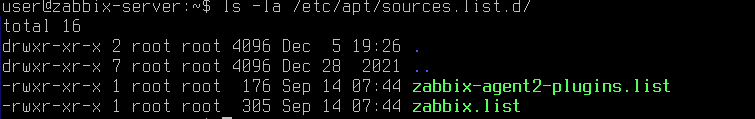

```bash
# Установка Zabbix Server
sudo apt install zabbix-server-pgsql zabbix-frontend-php php7.4-pgsql zabbix-apache-conf zabbix-sql-scripts nano -y 

# Создание пользователя с помощью psql из под root
su - postgres -c 'psql --command "CREATE USER zabbix WITH PASSWORD '\'123456789\'';"'
su - postgres -c 'psql --command "CREATE DATABASE zabbix OWNER zabbix;"'

# Импорт скачанной схемы
zcat /usr/share/zabbix-sql-scripts/postgresql/server.sql.gz | sudo -u zabbix psql zabbix

# Установка пароля в DBPassword
sed -i 's/# DBPassword=/DBPassword=123456789/g' /etc/zabbix/zabbix_server.conf
```
Проверка конфигурации

```bash
sudo nano /etc/zabbix/zabbix_server.conf 
```

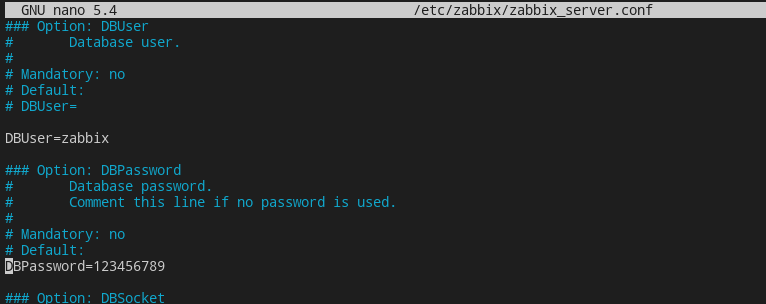

```bash
# Запуск Zabbix Server и web-сервер
sudo systemctl restart zabbix-server apache2 
sudo systemctl enable zabbix-server apache2 
```

Или все то же самое с установкой zabbix-server через ansible

ansible-playbook [playbook_install_server.yml](ansible/playbook_install_server.yml) -b


```yaml
# Install zabbix-server
- name: Play1 Add repo
  hosts: zabbix-server
  become: yes
  tasks:

  - name: Download repo Zabbix
    shell: wget https://repo.zabbix.com/zabbix/6.0/debian/pool/main/z/zabbix-release/zabbix-release_6.0-4%2Bdebian11_all.deb
  
  - name: install repo
    shell: dpkg -i zabbix-release_6.0-4+debian11_all.deb

  - name: Update apt packages
    become: true
    apt:
      update_cache: yes

- name: Play2 Install Zabbix-server
  hosts: zabbix-server
  become: yes
  tasks:

  - name: install postgresql
    apt:
      name:
        - postgresql
      state: present
  
  - name: install zabbix-server 
    apt:
      name:
        - zabbix-server-pgsql
        - zabbix-frontend-php 
        - php7.4-pgsql 
        - zabbix-apache-conf 
        - zabbix-sql-scripts 
        - nano
      state: present
  
  
  - name: make user psql
    shell: su - postgres -c 'psql --command "CREATE USER zabbix WITH PASSWORD '\'123456789\'';"' 
    ignore_errors: true

  - name: make user psql2
    shell: su - postgres -c 'psql --command "CREATE DATABASE zabbix OWNER zabbix;"'
    ignore_errors: true
    
  - name: extract archive
    shell: zcat /usr/share/zabbix-sql-scripts/postgresql/server.sql.gz | sudo -u zabbix psql zabbix

    
  - name: set passwd DB
    shell:  sed -i 's/# DBPassword=/DBPassword=123456789/g' /etc/zabbix/zabbix_server.conf

  
  - name: retart and enable zabbix-server
    systemd:
      name: zabbix-server
      state: restarted
      enabled: yes

  - name: retart and enable apache2
    systemd:
      name: apache2
      state: restarted
      enabled: yes

  - name: zabbix-server status
    shell:  service zabbix-server status
    register: zabbixtxt
  
  - name: "Print the file content to a console"
    debug:
      msg: "{{ zabbixtxt.stdout }}"
 
  - name: rm package file
    shell: rm zabbix-release_6.0-4+debian11_all.deb*
 
 ```

Настройка web-сервера по адресу 
http://<ip_сервера>/zabbix

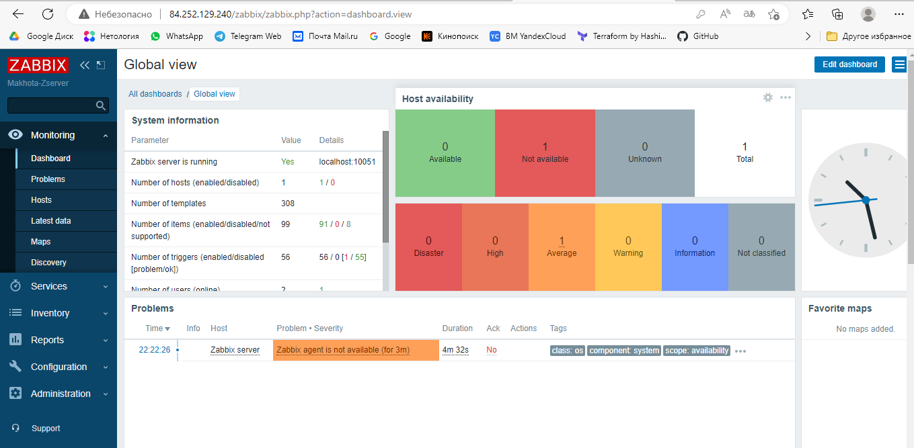


---

### Задание 2 

Установите Zabbix Agent на два хоста.

*Приложите скриншот раздела Configuration > Hosts, где видно, что агенты подключены к серверу.*
*Приложите скриншот лога zabbix agent, где видно, что он работает с сервером.*
*Приложите скриншот раздела Monitoring > Latest data для обоих хостов, где видны поступающие от агентов данные.*
*Приложите текст использованных команд в GitHub.*

### *Ответ к Заданию 2*
Создание двух хостов с помощью terraform в yandex cloud.

[variables.tf](terraform/variables.tf)

```HCL
variable "OAuthTocken" {
  default = "....."
}

variable "vm_ips" {
  type        = map(any)
  description = "List of IPs used for the Vms"
}

variable "guest_name_prefix" {
  default = "makhota-test"
}
```

[terraform.tfvars](terraform/terraform.tfvars)

```HCL
vm_ips = {
  "0" = "10.128.0.10"
  "1" = "10.128.0.11"
  "2" = "10.128.0.12"
}
```

[meta.txt](terraform/meta.txt)

```yaml
#cloud-config
users:
 - name: user
   groups: sudo
   shell: /bin/bash
   sudo: ['ALL=(ALL) NOPASSWD:ALL']
   ssh-authorized-keys:
     - ssh-rsa  ..... user@makhotaev
```
[main.tf](terraform/main.tf)

```HCL
terraform {
  required_providers {
    yandex = {
      source = "yandex-cloud/yandex"
    }
  }
}

provider "yandex" {
  token     = var.OAuthTocken
  cloud_id  = "b1gob4asoo1qa32tbt9b"
  folder_id = "b1gob4asoo1qa32tbt9b"
  zone      = "ru-central1-a"
}


  
//create zabbix-agents

resource "yandex_compute_instance" "vm-agent" {
  name = "${var.guest_name_prefix}-vm0${count.index + 1}" #variables.tf 
  count = 2    


  resources {
    cores     = 4
    memory    = 4
  
  }

  boot_disk {
    initialize_params {
      image_id = "fd8456n7d102l8p6ipgl" #Debian 11
      type     = "network-ssd"
      size     = "16"
    }
  }

    network_interface {
    subnet_id = "e9bf0qhr78eltofkhvbb"
    nat       = true
    ip_address     = lookup(var.vm_ips, count.index) #terraform.tfvars
    }

  
  metadata = {
    user-data = "${file("./meta.txt")}"
  }


  provisioner "remote-exec" {
    connection {
      host = lookup(var.vm_ips, count.index) #terraform.tfvars
      type        = "ssh"
      private_key = "${file("~/.ssh/id_rsa")}"
      port        = 22
      user        = "user"
      agent       = false
      timeout     = "1m"
    }
    inline = ["sudo hostnamectl set-hostname ${var.guest_name_prefix}-vm0${count.index + 1}"]
  }    
}
```

Установка zabbix-agent


```bash
# Добавление репозитория Zabbix
wget https://repo.zabbix.com/zabbix/6.0/debian/pool/main/z/zabbix-release/zabbix-release_6.0-4%2Bdebian11_all.deb
dpkg -i zabbix-release_6.0-4+debian11_all.deb
apt update
# Установка Zabbix Server и компонентов
sudo apt install zabbix-agent -y
# Запуск Zabbix Agent
sudo systemctl restart zabbix-agent
sudo systemctl enable zabbix-agent
```

Либо то же самое сразу на 2 хоста через ansible:

[hosts](ansible/hosts)

```bash
[zabbix-agents]
10.128.0.10 ansible_ssh_private_key_file=/home/user/.ssh/id_rsa ansible_user=user ansible_python_interpreter=/usr/bin/python3
10.128.0.11 ansible_ssh_private_key_file=/home/user/.ssh/id_rsa ansible_user=user ansible_python_interpreter=/usr/bin/python3

[zabbix-server]
10.128.0.102 ansible_ssh_private_key_file=/home/user/.ssh/id_rsa ansible_user=user ansible_python_interpreter=/usr/bin/python3

```

ansible-playbook [playbook_install_agents.yml](ansible/playbook_install_agents.yml) -b

```yaml
# Install zabbix-agent
- name: Play1 Add repo
  hosts: all
  become: yes
  tasks:

  - name: Download repo Zabbix
    shell: wget https://repo.zabbix.com/zabbix/6.0/debian/pool/main/z/zabbix-release/zabbix-release_6.0-4%2Bdebian11_all.deb
  
  - name: install repo
    shell: dpkg -i zabbix-release_6.0-4+debian11_all.deb

  - name: Update apt packages
    become: true
    apt:
      update_cache: yes

- name: Play2 Install Zabbix-agent
  hosts: all
  become: yes
  tasks:

  - name: install zabbix-agent 
    apt:
      name:
        - zabbix-agent
      state: present
  
  - name: retart and enable zabbix-agent 
    systemd:
      name: zabbix-agent
      state: restarted
      enabled: yes


  - name: zabbix-agent status
    shell:  service zabbix-agent status
    register: zabbixtxt


  
  - name: "Print the file content to a console"
    debug:
      msg: "{{ zabbixtxt.stdout }}"
 
  - name: rm package file
    shell: rm zabbix-release_6.0-4+debian11_all.deb*
 
```

Добавляем хосты в zabbix-server

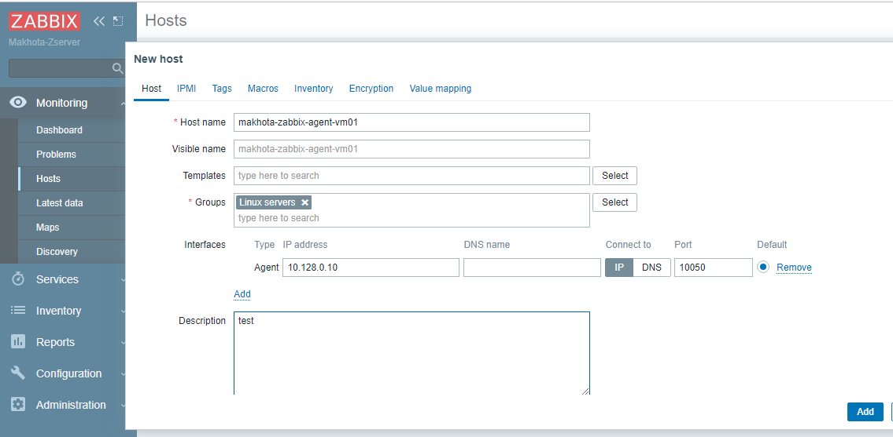


```bash
# Меняем адрес сервера в zabbix_agentd.conf
sed -i 's/Server=127.0.0.1/Server=10.128.0.102'/g' /etc/zabbix/zabbix_server.conf
```

Либо то же самое сразу на два хоста через ansible

ansible-playbook [playbook_setip_server.yml](ansible/playbook_setip_server.yml) -b

```yaml

# Permission  zabbix-server connect to zabbix-agent
- name: Play1 permission zabbix-server
  hosts: zabbix-agents
  become: yes
  tasks:

  - name: set ip zabbix-server
    become: yes
    shell: sed -i "s/Server=127.0.0.1/Server=10.128.0.102/g" /etc/zabbix/zabbix_agentd.conf


  - name: retart and enable zabbix-agent 
    systemd:
      name: zabbix-agent
      state: restarted
      enabled: yes
```

Добавила template

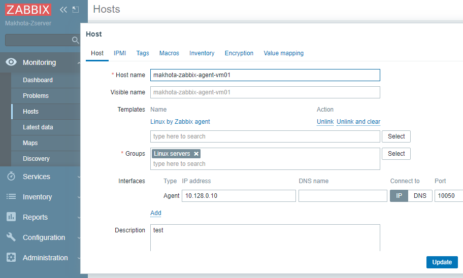

В логах пропали ошибки соединения

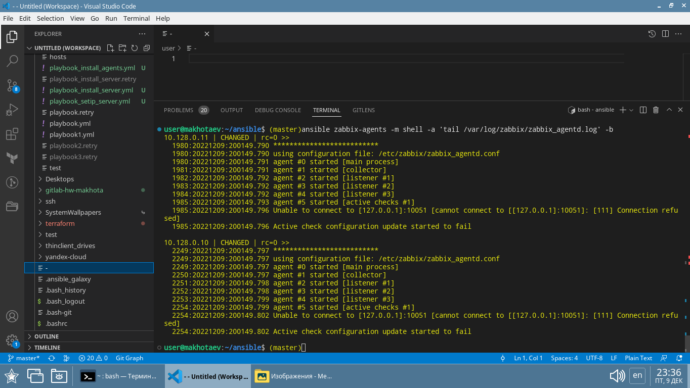

Хосты позеленели

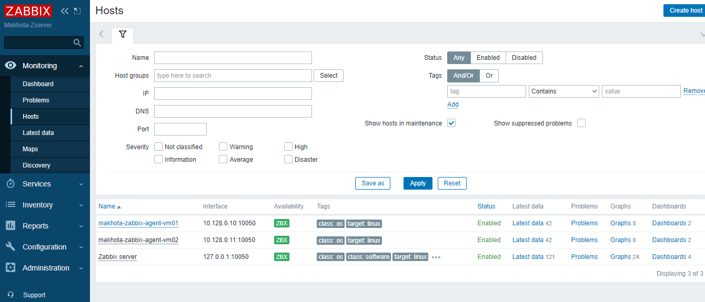

Подгрузились данные Latest data 

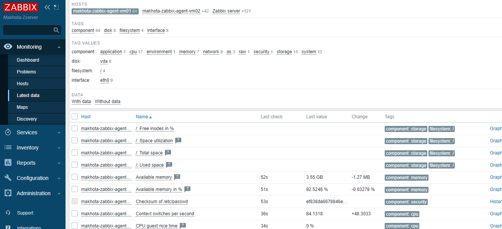

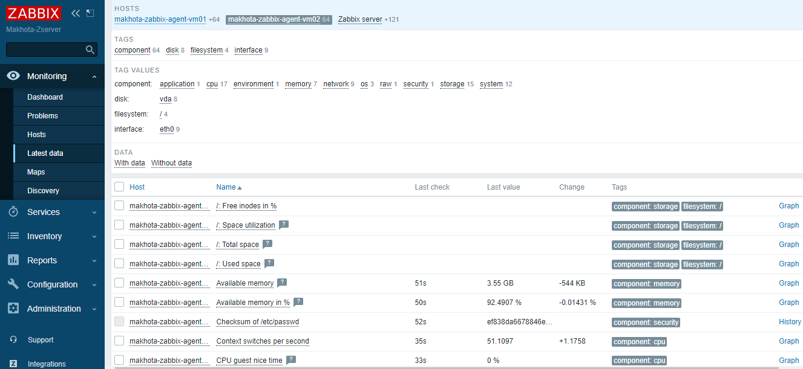

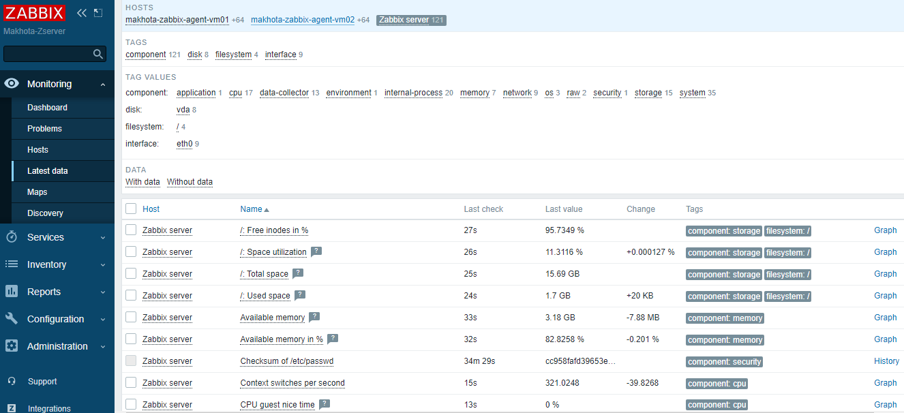


---
## Дополнительное задание (со звездочкой*)

Это задание дополнительное (необязательное к выполнению) и никак не повлияют на получение вами зачета по этому домашнему заданию. Вы можете его выполнить, если хотите глубже и/или шире разобраться в материале.

### Задание 3* 

Установите Zabbix Agent на Windows компьютер и подключите его к серверу Zabbix.

*Приложите скриншот раздела Latest Data, где видно свободное место на диске C:*

### *Ответ к Заданию 3*

[Скачать zabbix-agent для windows](https://cdn.zabbix.com/zabbix/binaries/stable/6.0/6.0.12/zabbix_agent-6.0.12-windows-i386.zip)

Выбрать нужную версию [тут](https://www.zabbix.com/download_agents?version=6.0+LTS&release=6.0.12&os=Windows&os_version=Any&hardware=i386&encryption=No+encryption&packaging=Archive&show_legacy=0)

**Подготовка**

Zabbix агент распространяется в виде zip архива. После того, как вы скачан архив,  нужно распаковать его. Выберите любую папку для хранения Zabbix агента и конфигурационного файла, например.

```
C:\zabbix
```
Скопировать файлы bin\zabbix_agentd.exe и conf\zabbix_agentd.conf в c:\zabbix.

Отредактировать файл c:\zabbix\zabbix_agentd.conf для активного агента, так как мой хост находится за натом с серым адресом:

```
Hostname=Windows Makhota agent
HostnameItem=system.hostname
HostMetadataItem=system.uname
```
**Установка zabbix-agent на windows**

Вызываем командную строку windows `ctrl + x` с правами администратора

Используем следующую команду для установки Zabbix агента как службы Windows:

```
C:\> c:\zabbix\zabbix_agentd.exe -c c:\zabbix\zabbix_agentd.conf -i
```
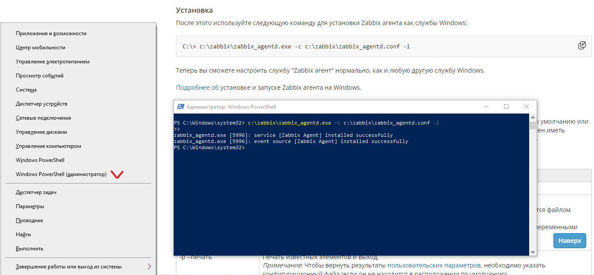

**Добавляем авторегистрацию** активного агента windows на web zabbix-server

Configurations > actions > Autoregistration actions > Create action

```
Name:
  Авторегистрация Windows хостов

Conditions
  Type Host metadata 
  Operator contains 
  Value Windows

Operations
  Add host 
  Link to templates: Windows by Zabbix agent active 
  Enable host
```

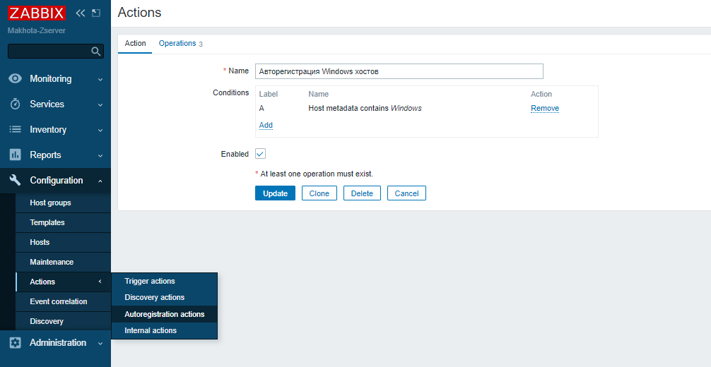
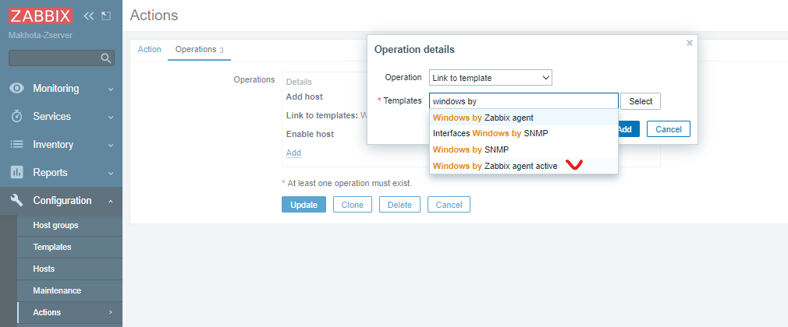


**Обновить и перезапустить службу windows**

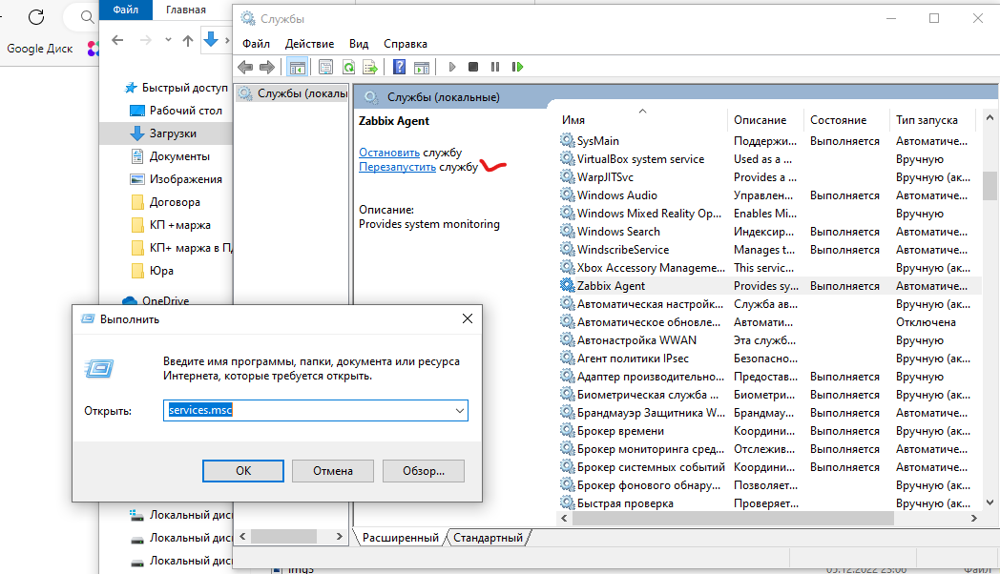

**Результат**

Активный zabbix-agent имеет серый Unknown interface status - это нормально, поскольку в отличие от пассивного агента соединение инициирует активный zabbix-agent вместо  zabbix-server

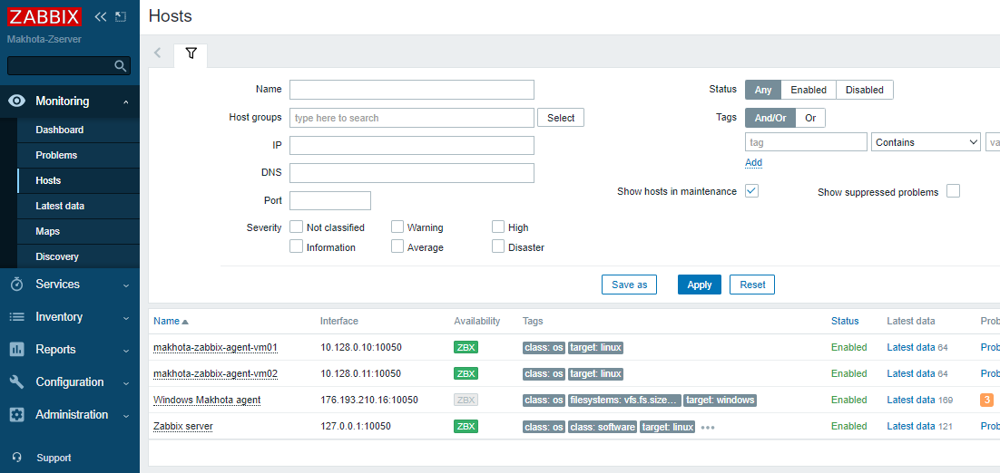

Стандартный шаблон zabbix-server для windows подгружает только общий объем диска С и занятый объем

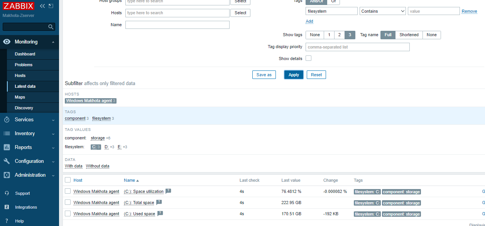

Поэтому [скачала с сайта www.mihanik.net](https://www.mihanik.net/monitoring-diskovogo-prostranstva-aktivnym-zabbix-agentom/?ysclid=lbi42xk55m364682283) [дополнительный шаблон](template%20zabbix/zbx_export_templates_Active_Computer_SystemDrive.xml) и импортировала его в zabbix-server, добавила к шаблонам хоста `Windows Makhota agent`

в итоге можно мониторить и свободное место на диске C:

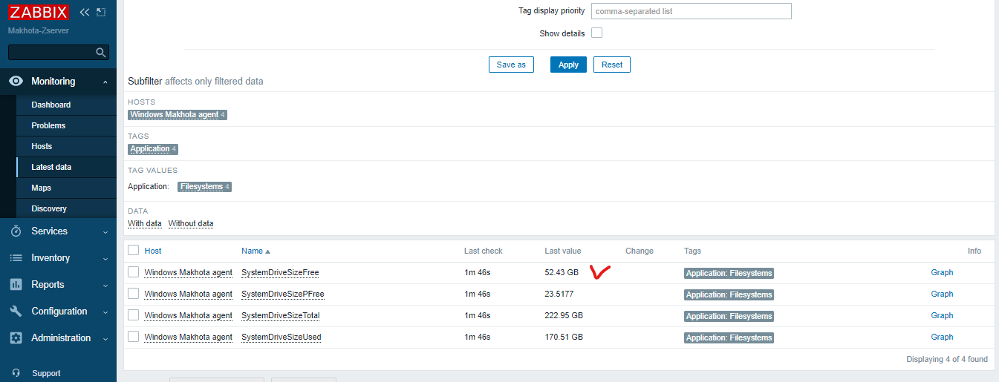

